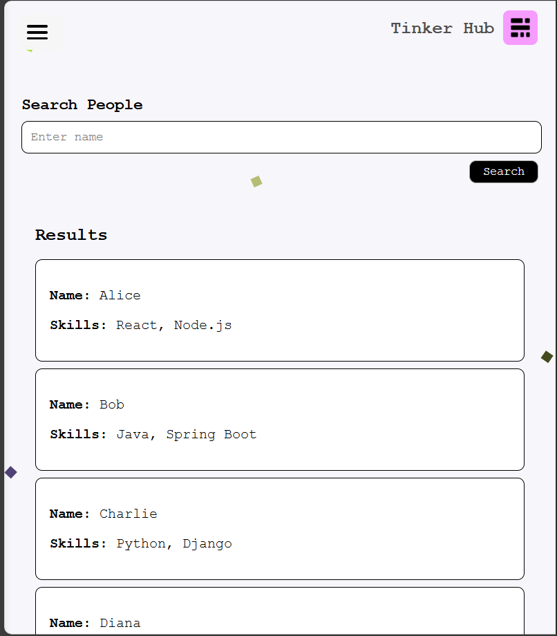

# TinkerHub

Profile Page Project

Overview
This project is a simple and responsive profile page created with HTML, CSS, and JavaScript. It includes a visually appealing design, dynamic features, and social media links. The project is ideal for showcasing user profiles or as a template for personal portfolio websites.

Features
Responsive Design: Adapts to various screen sizes and devices.
Profile Details: Displays a profile image, name, skills, and social media links.
Dynamic Background: Includes a color-block background effect for aesthetics.
Navigation: A back button to return to the homepage.
Hover Effects: Social media icons and buttons have hover effects for better interactivity.
Technologies Used
HTML5: Structure of the webpage.
CSS3: Styling and responsive design.
JavaScript: Adds interactivity to the profile page.

link:<a href="https://tinker-hub-r2ob.vercel.app/">Click me </a>
link normal:<a href="https://tinker-hub.vercel.app/">click</a>